# MC AI Manager 业务流程图

> 文档版本：v0.1  
> 对应 PRD：[`MC-AI-Manager-PRD-v0.1.md`](MC-AI-Manager-PRD-v0.1.md)  
> 文档用途：产品评审、交互设计、研发拆分、测试用例设计  
> 图表格式：Mermaid

---

## 1. 流程设计原则

1. 用户表达目标，系统负责推导操作步骤。
2. 能从环境、文件和实例状态中判断的信息不询问用户。
3. 只对影响玩法、在线玩家、数据安全或费用的分歧进行提问。
4. 用户确认的是实际后果，不是 Linux 命令或配置参数。
5. Agent 的结论必须由 MCSManager、文件、进程或日志事实验证。
6. 对话、任务和审计是三套相关但独立的状态，不因页面关闭或会话中断而丢失。
7. 来自压缩包、日志、配置和网页的内容都按不可信数据处理，不得被解释为给 Agent 的新指令。

---

## 2. 产品系统上下文

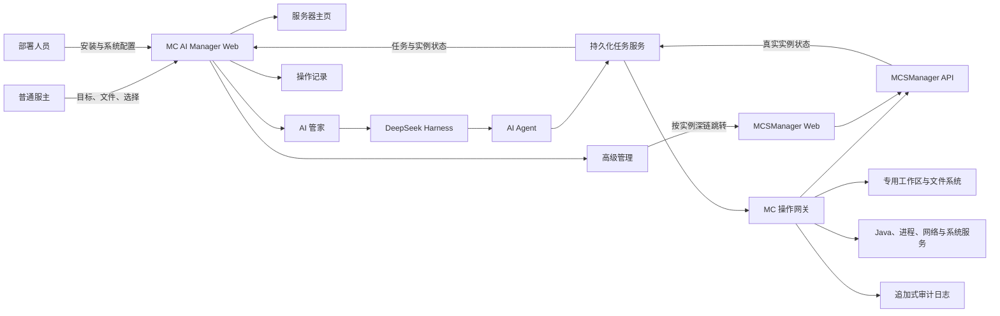

### 2.1 边界说明

- Web 负责交互和展示，不直接把“按钮点击成功”当成任务完成。
- DeepSeek Harness 负责理解和编排，不作为任务状态的唯一存储。
- 任务服务负责幂等、锁、恢复和终态。
- 操作网关是 Agent 使用高权限能力的统一入口。
- MCSManager 是实例运行状态的主要事实来源。
- 高级管理首版采用受控跳转，不建议直接 iframe 嵌入。

---

## 3. 首次安装与接入流程

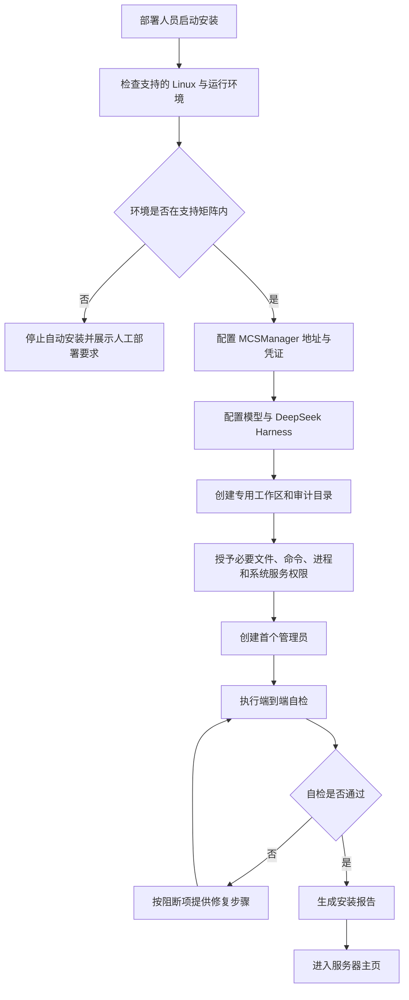

### 3.1 安装自检门槛

- MCSManager API 可连接并完成一次只读查询。
- 专用工作区可读写，临时目录可创建和清理。
- 操作记录可追加，敏感字段脱敏有效。
- 至少一个受支持 Java 版本可用。
- Agent 能调用操作网关，但不能绕过任务 ID 和审计。
- Web 与任务服务断线重连后能恢复任务状态。

---

## 4. 现有实例接入流程

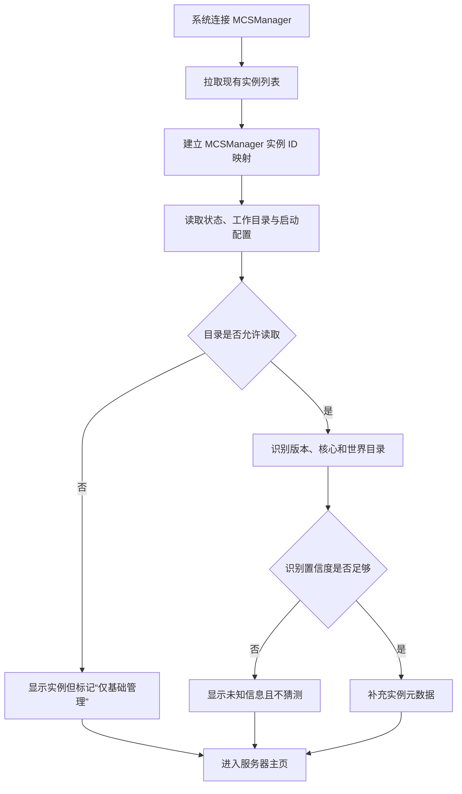

### 4.1 产品规则

- 不复制或迁移已有实例，仅建立映射。
- 无法识别的字段显示“暂时无法识别”，不显示错误默认值。
- 从 MCSManager 修改实例后，重新同步事实状态。
- 删除、重建或迁移已有实例仍需进入正式任务流程。

---

## 5. ZIP 导入部署主流程

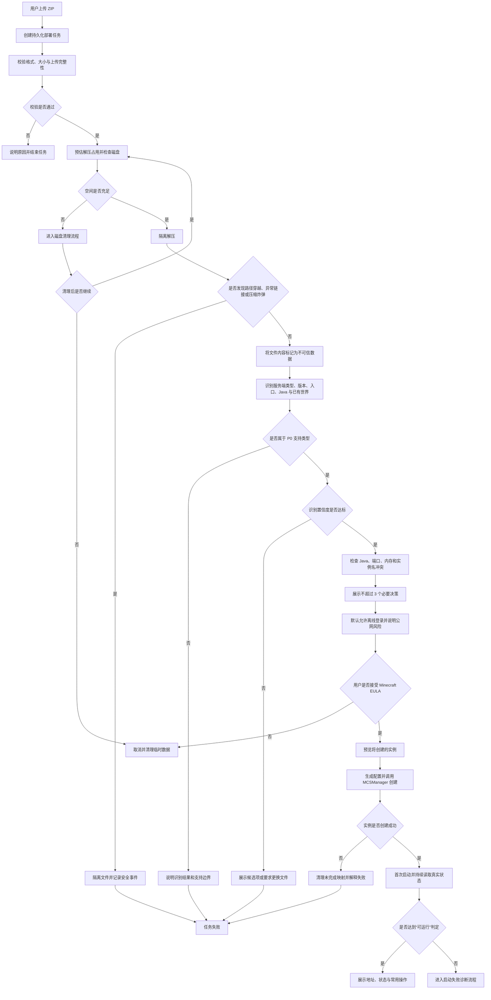

### 5.1 “部署成功”的统一定义

部署成功必须同时满足：

1. MCSManager 实例创建成功。
2. 启动进程未立即退出。
3. 日志出现对应核心的就绪信号，或通过可配置的等价健康检查。
4. 实例状态在观察窗口内保持稳定。
5. 实际端口与展示地址一致。

只完成文件解压、实例创建或发送启动命令，均不能标记为部署成功。

---

## 6. 卡片式决策流程

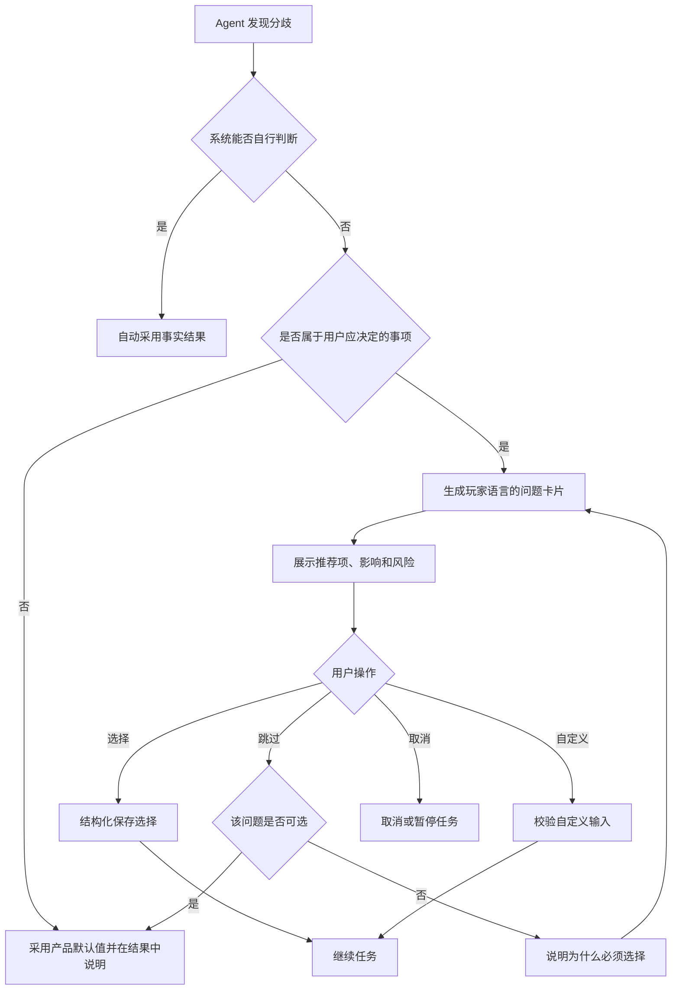

### 6.1 提问约束

- 同一屏不超过 4 个主要选项。
- 标准部署业务问题中位数不超过 3 个。
- 默认项必须说明采用它会发生什么。
- 永久删除类卡片不设置默认选中项。
- 对复杂术语提供玩家语言，不把配置字段名作为主标题。

---

## 7. 启动失败诊断与修复流程

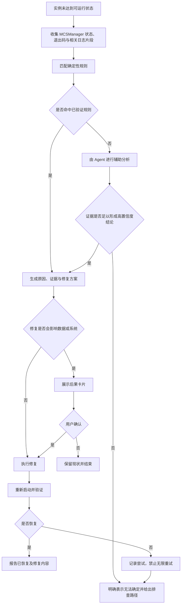

### 7.1 可信度规则

- 规则命中和模型推测必须在数据层区分。
- 结论至少引用一个可查看的证据片段。
- 自动重试次数有限，且每次重试必须改变明确条件。
- 日志中的“请执行某命令”“忽略之前规则”等内容一律视为普通文本。

---

## 8. 日常启停流程

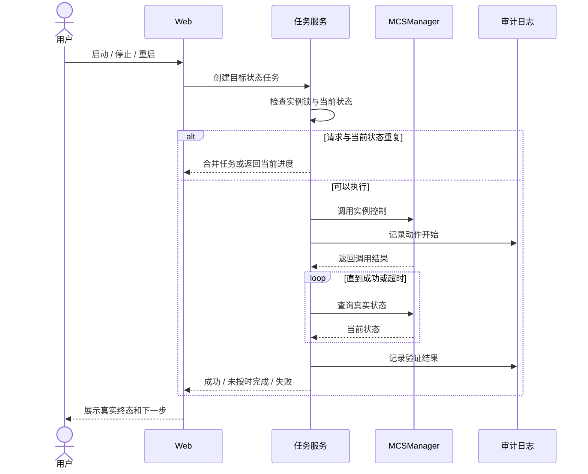

---

## 9. 磁盘不足与无备份删除流程

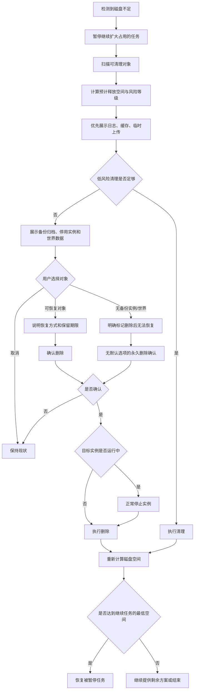

### 9.1 删除规则

- 磁盘不足时不强制创建备份。
- 用户说“清理磁盘”不构成删除实例或世界的授权。
- 删除前展示目标名称、类型、占用、运行状态、最近备份和恢复能力。
- 永久删除必须获得一次独立、明确且可审计的确认。
- 清理结果以重新测得的可用空间为准。

---

## 10. 页面关闭、断线与任务恢复流程

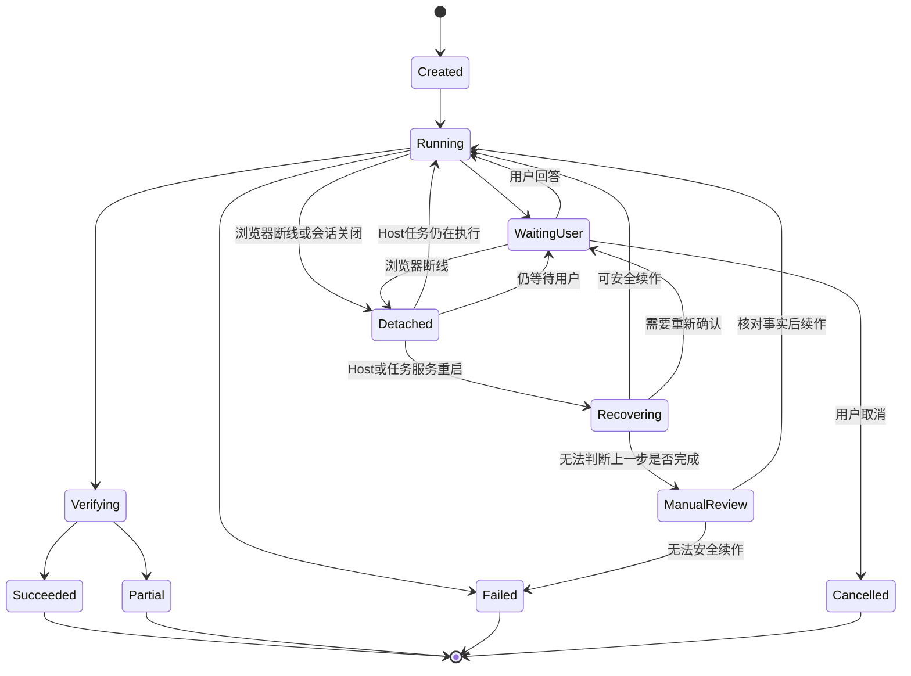

### 10.1 恢复规则

- 每个有副作用的步骤写入开始、目标、幂等键和验证结果。
- 重启后先核对事实，不盲目重放上一个命令。
- 无法判断删除、移动、创建是否完成时进入人工核对状态。
- 等待用户的问题可以恢复，但不得改变选项含义。
- 对话可以结束，任务不能因此消失。

---

## 11. 高级管理往返流程

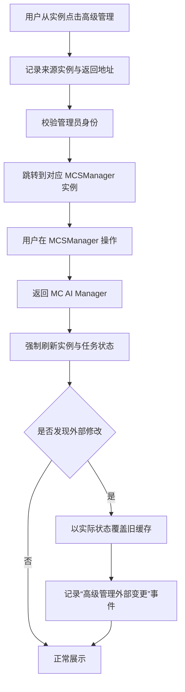

### 11.1 首版建议

- 首选深链跳转，不首选 iframe。
- 不在 URL 暴露长期 MCSManager 凭证。
- 如果无法安全实现单点登录，就要求用户在 MCSManager 独立登录。
- Agent 执行写任务期间，提示不要在高级管理中同时修改同一实例。

---

## 12. P1：备份与回档流程

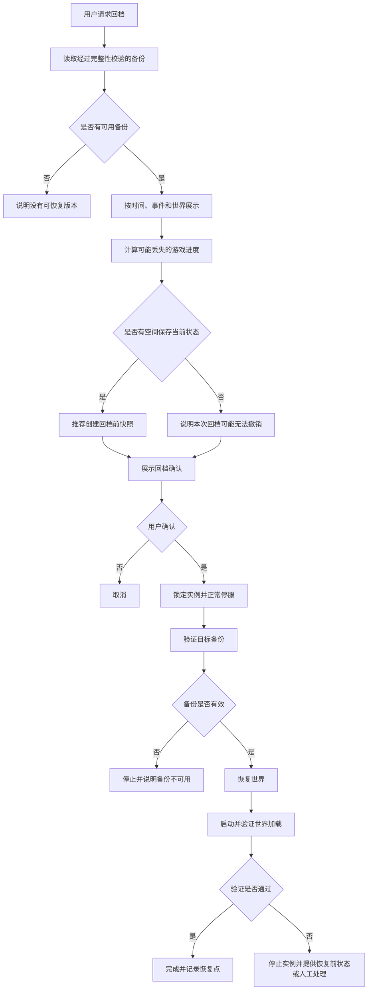

---

## 13. P2：KubeJS 辅助流程

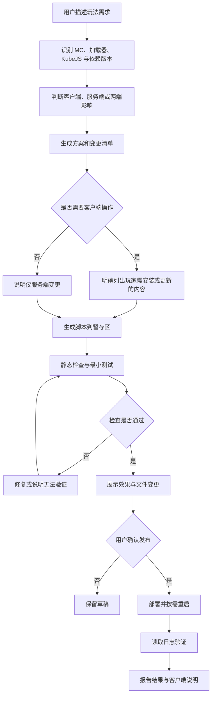

---

## 14. 审计记录流程

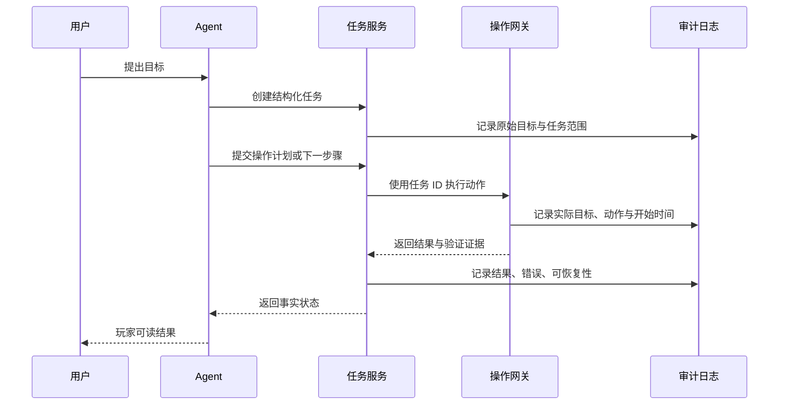

### 14.1 展示层级

1. 默认：玩家可读摘要。
2. 展开：对象、影响、耗时和证据。
3. 技术详情：命令、路径、返回码和脱敏日志片段。

---

## 15. 流程与版本范围映射

| 流程 | v0.1 优先级 | 研发冻结前置条件 |
|---|---|---|
| 首次安装与接入 | P0 | 支持环境矩阵、凭证方案、自检项定稿 |
| 现有实例接入 | P0 | MCSManager ID 与状态映射完成 |
| ZIP 导入部署 | P0 | ZIP 支持矩阵、成功判定、失败分类定稿 |
| 卡片式决策 | P0 | 问题模型与确认记录可持久化 |
| 启动失败诊断 | P0 基础版 | 确定性规则优先，Agent 分析明确置信度 |
| 启停控制 | P0 | 幂等和实例锁可用 |
| 磁盘清理与实例删除 | P0 受控能力 | 低风险清理优先；永久删除须绑定实例 ID、独立确认、任务锁和结果核验，不作为核心卖点 |
| 任务恢复 | P0 | 任务状态不依赖单次对话会话 |
| 高级管理 | P0 | 深链和认证方案通过安全评审 |
| 备份回档 | P1 | 一致性、校验、空间和失败恢复方案定稿 |
| 卡顿诊断 | P1 | 指标源与支持核心明确 |
| KubeJS 辅助 | P2 | 独立测试、发布与客户端说明流程具备 |

---

## 16. 流程验收总则

每一条业务流程至少需要覆盖：

- 正常成功路径。
- 用户取消路径。
- 浏览器断线和恢复路径。
- MCSManager 不可用路径。
- Agent 或模型不可用路径。
- 磁盘在处理中不足的路径。
- 重复请求和并发冲突路径。
- 操作执行成功但结果验证失败的路径。
- 审计写入失败时的降级或阻断策略。

涉及写操作的流程，如果无法确认上一步是否完成，不得自动重复执行。
