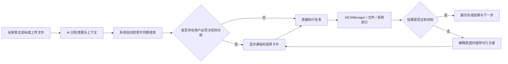
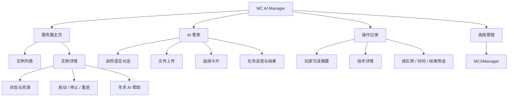
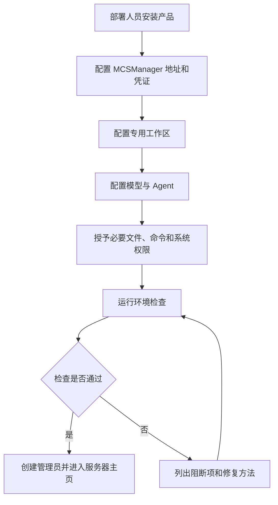
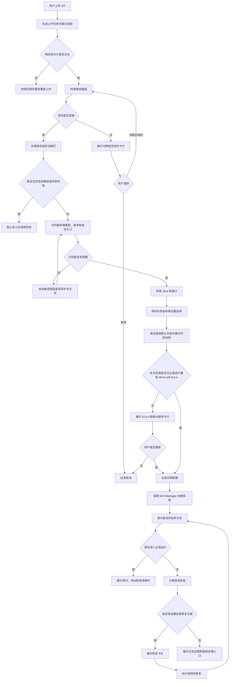
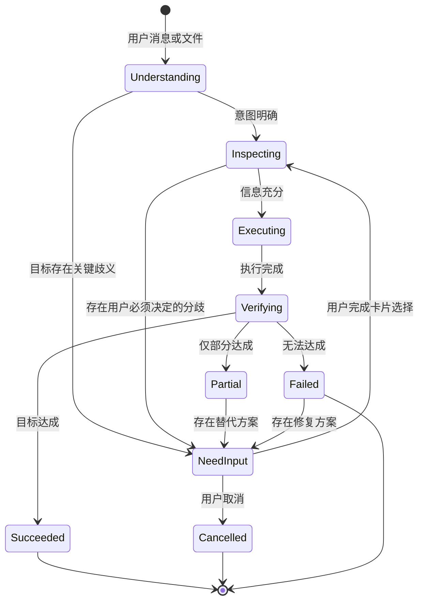
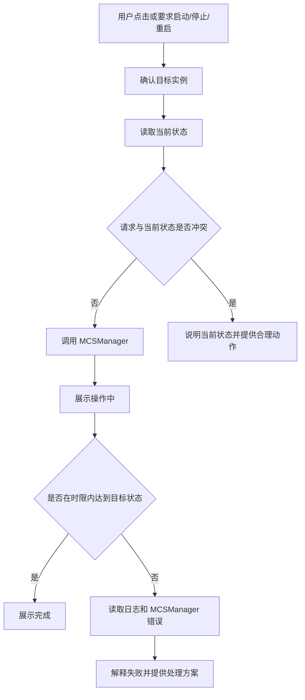
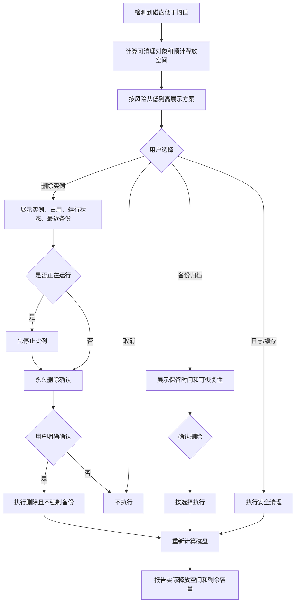
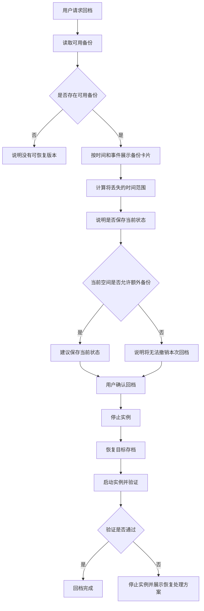
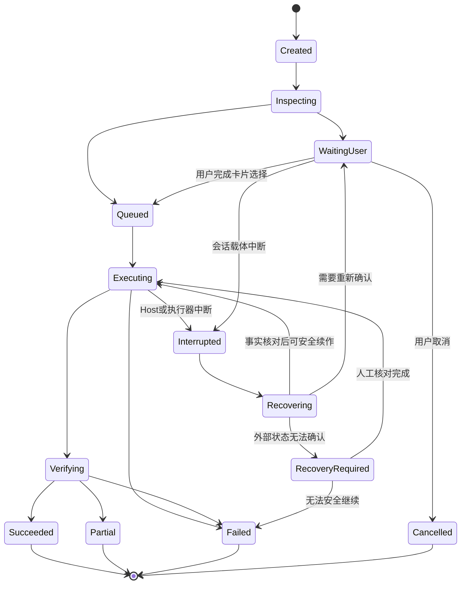

# MC AI Manager 产品需求文档（PRD）

> 产品暂名：MC AI Manager  
> 文档版本：v0.1  
> 产品阶段：Demo / MVP 验证  
> 文档状态：条件立项评审版  
> 目标读者：产品、设计、前端、后端、Agent 工程、测试、部署人员

---

## 1. 执行摘要

MC AI Manager 是一款面向普通 Minecraft 爱好者和服主的服务器管理工具。它以 MCSManager 作为实例执行与监控底座，以 DeepSeek Harness 作为 AI 任务理解和交互入口，把“上传文件、理解目录、运行命令、阅读日志、修改配置”等专业操作转化为玩家能理解的目标、选项和结果。

产品首版要验证的核心命题不是“AI 能执行多少 Linux 命令”，而是：

> 一个不了解 Linux、Java 服务端结构和 MCSManager 的玩家，是否能仅通过上传一个服务端压缩包、回答少量通俗问题，在可预期的时间内得到一个能够正常启动和管理的 MC 服务器。

首版产品由四个主要入口组成：

1. **服务器主页**：查看服务器是否正常，以及执行最常用的启停操作。
2. **AI 管家**：上传文件、提出需求、回答必要问题、查看任务结果。
3. **操作记录**：了解 AI 做过什么、是否成功、是否存在不可恢复的操作。
4. **高级管理**：进入 MCSManager 原始界面，供部署人员和高级用户使用。

### 1.1 产品结论

该产品方向合理，价值链成立，建议**条件立项**：允许启动 M0 技术探针和 M1 受控部署闭环，但当前版本不能直接作为 P0 研发冻结基线。研发冻结前必须明确 P0 支持矩阵、受控操作网关、持久化任务与恢复模型、实例可运行判定、最小身份认证，以及高级入口、EULA、离线登录和永久删除的安全规则。

原始设想的 MVP 范围偏大。首版必须先把“导入—识别—配置—启动—验证—解释失败”做成稳定闭环。卡顿深度诊断、完整回档体系和 KubeJS 自动开发都具有独立产品复杂度，不应与部署闭环同时作为 P0 上线门槛。

### 1.2 首版范围结论

- **P0：必须完成**——环境可用性检查、ZIP 导入部署、卡片决策、实例启停、启动失败解释、操作记录、低磁盘预警与安全清理、MCSManager 高级入口。
- **P1：验证后补充**——完整备份回档、运行中卡顿诊断、常见配置管理、模组或插件冲突定位。
- **P2：后续能力**——KubeJS 开发助手、整合包平台一键安装、多用户权限、多节点和跨机迁移。

---

## 2. 背景与问题

### 2.1 用户现状

普通玩家部署 MC 服务端时通常会遇到以下门槛：

- 不理解 Linux 路径、权限、端口和进程。
- 不知道压缩包应该上传到哪里、如何解压、哪个文件是启动入口。
- 不知道服务端需要哪个 Java 版本。
- 难以区分 Forge、Fabric、NeoForge、Paper 等服务端类型。
- 看不懂控制台和崩溃日志。
- 不理解 MCSManager 中实例、守护进程、工作目录和启动命令等概念。
- 遇到卡顿、崩溃、磁盘不足或存档损坏时，不知道先检查什么。
- 容易因错误删除、覆盖或回档造成不可逆的数据损失。

MCSManager 已经能够管理实例和进程，但它主要解决“服务器如何被管理”的问题，没有充分解决“非专业用户如何表达意图并正确完成管理”的问题。

### 2.2 产品机会

AI Agent 可以将用户目标转化为检查、文件操作、MCSManager API 调用和系统命令，并根据实时结果继续处理。这使产品能够从传统的“功能面板”升级为“目标驱动的管理工具”。

用户不需要知道该点击哪个底层功能，只需要表达：

- “帮我把这个服务端开起来。”
- “服务器为什么进不去？”
- “最近很卡，帮我看看。”
- “恢复到昨晚还没炸服的时候。”
- “磁盘满了，哪些东西可以删？”

### 2.3 核心产品假设

| 编号 | 假设 | 验证方式 |
|---|---|---|
| H1 | 普通玩家愿意用自然语言代替传统面板完成复杂操作 | 观察 AI 管家任务发起占比与完成率 |
| H2 | 上传 ZIP 是用户最自然的部署入口 | 测试用户能否无指导完成首次导入 |
| H3 | AI 能可靠识别主流 Java 服务端结构 | 建立样本集并统计识别准确率 |
| H4 | 用户能理解卡片中的影响描述并作出正确选择 | 可用性测试和误操作复盘 |
| H5 | MCSManager API 与受控系统能力足以支撑任务闭环 | 对每类任务进行端到端技术验证 |
| H6 | 用户关心结果多于命令细节，但在失败时需要可展开的证据 | 观察技术详情展开率和问题反馈 |

---

## 3. 产品目标与非目标

### 3.1 v0.1 目标

1. 让目标用户无需输入 Linux 命令即可导入并启动主流 Java 服务端 ZIP。
2. 把必须由用户决定的问题转化为通俗、有限、可解释的卡片选项。
3. 当部署失败时，给出明确原因和可执行的下一步，而不是只展示原始日志。
4. 让常用实例操作在统一首页完成。
5. 让 Agent 的关键操作可追踪，永久性操作的影响可理解。
6. 验证 MCSManager、DeepSeek Harness 和系统操作层的集成可行性。

### 3.2 v0.1 非目标

- 不完全替代 MCSManager。
- 不支持复杂多租户、商业计费和细粒度 RBAC。
- 不保证兼容全部游戏版本、服务端核心和非标准整合包。
- 不在 P0 中实现自动化性能调优。
- 不在 P0 中实现完整 KubeJS 项目开发。
- 不在 P0 中支持跨节点迁移或集群调度。
- 不把任意 Shell 能力直接展示给普通玩家。

### 3.3 产品原则

1. **先说结果，再说过程**：用户先看到“已启动”或“缺少 Java 17”，技术过程可展开。
2. **只问真正的分歧**：可从文件和环境中判断的信息不询问用户。
3. **用玩家语言表达**：使用“允许离线登录”，不使用 `online-mode=false` 作为主文案。
4. **影响可见**：删除、覆盖、回档必须说明对象、影响范围和可恢复性。
5. **任务有终态**：每项任务必须明确成功、部分成功、失败、取消或等待用户。
6. **高级能力不污染主路径**：MCSManager 和技术日志保留，但不占据普通用户默认界面。
7. **权限足够，使用有界**：Agent 获得完成任务所需权限；产品通过作用域、确认和审计降低误操作风险。

---

## 4. 目标用户与角色

### 4.1 核心用户画像

#### A. 普通服主（核心）

- 会玩 MC，会下载服务端或整合包。
- 不熟悉 Linux、Java 参数和服务器运维。
- 期望快速开服，并在出问题时得到直接帮助。
- 能理解“会丢失两小时进度”，但不理解文件系统和回滚命令。

#### B. 有经验的玩家管理员（次要）

- 熟悉部分服务端配置和模组。
- 希望 AI 减少重复操作，但需要查看日志和进入高级管理。

#### C. 部署技术人员（非日常用户）

- 负责公网部署、MCSManager 配置、模型凭证和系统权限。
- 负责初次安装和难以自动恢复的系统级故障。

### 4.2 系统参与角色

| 角色 | 责任 |
|---|---|
| 用户 | 提出目标、上传文件、确认影响用户体验或数据安全的选择 |
| AI Agent | 理解目标、规划步骤、调用工具、解释结果、提出必要问题 |
| 操作网关 | 提供文件、命令、备份、监控等能力，记录实际执行结果 |
| MCSManager | 管理实例进程、终端、状态和资源数据 |
| 主机系统 | 提供磁盘、Java、文件、网络、服务等运行环境 |
| 部署人员 | 完成安装、授权、外网和基础设施配置 |

---

## 5. 用户任务与价值主张

### 5.1 核心 JTBD

当我拿到一个 MC 服务端压缩包时，我希望直接把它交给系统，由系统判断如何运行并只询问我真正关心的设置，以便我不学习 Linux 也能开服。

### 5.2 次级 JTBD

- 当服务器启动失败时，我希望知道发生了什么，以及选择哪种修复方式。
- 当服务器运行异常时，我希望快速知道问题属于资源、配置还是模组。
- 当磁盘不足时，我希望知道删什么最安全、能释放多少空间。
- 当我要回档时，我希望按时间和影响选择存档，而不是寻找目录。
- 当我要实现玩法时，我希望系统判断服务端和客户端分别需要做什么。

### 5.3 价值链



---

## 6. MVP 范围与优先级复审

### 6.1 P0：Demo 上线门槛

| 模块 | P0 功能 | 纳入理由 |
|---|---|---|
| 环境 | MCSManager 连通性、工作区、磁盘、Java 基础检查 | 不先确认环境，后续失败无法归因 |
| 首页 | 实例列表、运行状态、版本、在线人数（可获得时）、基础资源、低磁盘提示 | 满足日常最常见查看需求 |
| 部署 | ZIP 上传、校验、安全解压、结构识别、Java 判断、创建实例、首次启动 | 核心价值闭环 |
| 决策 | DSH 卡片式单选/多选/自定义回答 | 降低专业概念暴露 |
| 配置 | 实例名称、离线登录默认值、端口冲突处理 | 部署必须配置 |
| 控制 | 启动、停止、重启，展示执行中和最终状态 | 最小管理能力 |
| 失败解释 | 识别常见启动失败并给出处理选项 | 防止产品只对成功样本有效 |
| 磁盘 | 容量预警、安全缓存/日志清理；实例永久删除需明确确认 | 主机最常见阻断问题 |
| 审计 | 关键操作记录、技术详情展开、结果与错误 | 建立信任和可排查性 |
| 高级入口 | 跳转或嵌入 MCSManager | 为高级需求保留逃生通道 |

### 6.2 P1：核心闭环稳定后

| 功能 | 延后理由 | 进入条件 |
|---|---|---|
| 完整备份与回档 | 涉及存档一致性、空间策略、恢复验证和撤销语义 | P0 部署成功率达标；明确备份格式和保留策略 |
| 卡顿诊断 | 指标来源和服务端类型差异大，容易给出虚假确定结论 | 建立 TPS/MSPT/资源指标采集能力 |
| 模组/插件冲突定位 | 需要版本知识库和大量失败样本 | 启动失败分类体系稳定 |
| 常用配置中心 | 需要定义跨核心的配置映射 | 用户调研确认高频配置项 |
| 自动安装 Java | 系统权限和发行版差异较大 | 部署环境范围确定并覆盖测试 |

### 6.3 P2：后续扩展

| 功能 | 原因 |
|---|---|
| KubeJS 脚本开发助手 | 本质上是独立的代码生成、依赖识别、测试与发布流程 |
| CurseForge/Modrinth 等平台一键安装 | 涉及第三方 API、授权、下载源和许可问题 |
| 多管理员与权限系统 | 单管理员假设验证后再扩展 |
| 多节点与迁移 | 需要调度、传输和一致性设计 |
| 移动端专用体验 | 先确保响应式 Web 可用 |
| 自动性能调优 | 错误调优可能损害玩法和稳定性，需要足够证据 |

### 6.4 对原计划的产品判断

#### 合理部分

- MCSManager 做底座而不是重新实现进程管理，技术路径合理。
- AI 只向用户确认可理解的分歧，符合目标人群。
- 上传 ZIP 作为部署入口，直观且可形成完整演示。
- 保留高级入口，避免为了极少数复杂操作拖大普通界面。
- 使用专用工作区，降低文件操作范围不明确的问题。
- 磁盘不足时不强制备份，符合真实运维约束。

#### 需要重定义的部分

1. **“给 Agent 全部权限”不能等价于“无边界执行”**  
   产品应保证 Agent 拥有完成任务所需能力，但默认任务作用域仍应绑定到目标实例、专用工作区和明确系统操作。系统级操作可以执行，必须记录目标和结果。

2. **“卡顿诊断”不能承诺自动解决**  
   P1 应定位为“收集证据、归因分类、提供方案”，不能在证据不足时直接调整 JVM 或删除模组。

3. **“回档”不是简单复制目录**  
   必须包含停服、当前状态处理、恢复、启动验证和失败后的处理策略，故不建议作为 P0 上线门槛。

4. **“KubeJS 辅助”范围过宽**  
   首次版本若纳入，只能做实验入口，不应作为 MVP 成功标准。

5. **“离线登录默认开启”需要显式风险文案**  
   默认值已确认，但公网场景必须提示名称冒用风险，不能让用户误以为其安全性与正版验证相同。

---

## 7. 信息架构



### 7.1 导航原则

- 默认落在服务器主页。
- AI 管家是全局固定入口，也可以从某个实例详情携带上下文进入。
- 操作记录不与普通聊天消息混为一谈。
- 高级管理的视觉层级最低，但随时可达。

---

## 8. 核心业务流程

### 8.1 首次安装与环境接入

该流程面向部署人员，不属于普通玩家日常使用路径。



环境检查至少覆盖：

- MCSManager API 是否可用。
- 工作区是否可读写。
- 上传和临时目录是否可用。
- 可用磁盘是否超过最低阈值。
- Java 是否存在以及有哪些版本。
- Agent 工具权限是否满足要求。
- 操作记录能否写入。

### 8.2 ZIP 服务端导入与部署



#### 导入识别结果

系统必须将上传内容归入以下状态之一：

- 可直接部署的完整服务端。
- 需要安装或生成服务端文件的整合包。
- 仅世界存档，不是完整服务端。
- 客户端整合包，不适合作为服务端直接运行。
- 无法识别或结构异常。
- 存在安全风险，拒绝解压或执行。

P0 只承诺对“可直接部署的完整 Java 服务端”形成自动闭环，其他类型需要清楚说明而非尝试碰运气。

### 8.3 AI 对话任务通用流程



每个任务都必须拥有：

- 唯一任务 ID。
- 目标实例或全局作用域。
- 当前阶段和玩家可读状态。
- 已执行动作及结果。
- 等待用户时的明确问题。
- 成功、部分成功、失败或取消终态。

### 8.4 实例启停流程



要求：

- 不因重复点击创建多个并发启停任务。
- 启动中、停止中不可显示为已完成。
- 超时不等于实例一定失败，应显示“未在预期时间内完成”并继续允许刷新状态。
- 重启应被视为“安全停止完成后再启动”，不能简单并发执行两个动作。

### 8.5 磁盘不足与删除流程



规则：

- 低风险对象优先：临时上传、过期安装文件、可再生成缓存、超期日志。
- 实例、世界和备份不得混称为“垃圾文件”。
- 删除流程不强制创建备份。
- 如果没有备份，必须明确写出“删除后无法恢复”。
- 预计释放空间与实际释放空间都要记录。
- 清理后必须重新检查磁盘，而不是仅以命令成功作为完成。

### 8.6 P1：备份与回档流程



---

## 9. 功能需求

### 9.1 服务器主页

#### FR-HOME-01 实例列表

每个实例卡片至少展示：

- 实例名称。
- 当前状态：已停止、启动中、运行中、停止中、异常、未知。
- 游戏版本和服务端类型（可识别时）。
- 在线人数（数据可获得时）。
- CPU、内存简化状态。
- 是否存在磁盘或启动异常。
- 启动、停止、重启和“问 AI”操作。

#### FR-HOME-02 状态文案

不得仅以颜色表示状态。每种状态必须有文字和一致图标。未知数据应显示“暂时无法获取”，不能显示为 0。

#### FR-HOME-03 快速操作

- 运行中：停止、重启。
- 已停止：启动。
- 启动中/停止中：禁用冲突操作并展示进度。
- 异常：查看原因、问 AI、进入高级管理。

### 9.2 AI 管家

#### FR-AI-01 输入能力

支持：

- 文本消息。
- ZIP 文件上传。
- 从实例详情进入时自动携带实例上下文。

#### FR-AI-02 卡片式提问

复用 DSH `ask_user_question`，支持：

- 标题、说明、单选、多选、自定义输入。
- 推荐选项置顶并说明推荐原因。
- 同一轮问题不超过 3 个；能自动判断的问题不得询问。
- 选项使用结果和影响描述，不使用底层参数名称。

#### FR-AI-03 任务进度

玩家可见阶段建议统一为：

- 正在检查。
- 等待你的选择。
- 正在处理。
- 正在确认结果。
- 已完成。
- 只完成了一部分。
- 未完成。
- 已取消。

不得用模型流式文本替代真实任务状态。

#### FR-AI-04 结果摘要

成功结果至少包含：

- 完成了什么。
- 目标实例。
- 当前状态。
- 用户接下来最可能执行的操作。

失败结果至少包含：

- 哪一步失败。
- 用户能理解的原因。
- 已执行操作是否留下影响。
- 可选解决方案。
- 技术详情入口。

### 9.3 ZIP 导入

#### FR-DEPLOY-01 上传

- 展示进度、文件名、大小和取消操作。
- 上传中断后不能进入解压阶段。
- 对重复文件给出重试或重新选择入口。

#### FR-DEPLOY-02 安全解压

- 在独立临时目录中解压。
- 阻止路径穿越、绝对路径覆盖和异常软链接。
- 计算解压后预计占用，防止压缩炸弹耗尽空间。
- 未完成识别前不得执行压缩包内脚本。

#### FR-DEPLOY-03 服务端识别

至少采集：

- 可能的启动 JAR 或脚本。
- 服务端核心类型。
- MC 版本。
- 所需 Java 版本。
- 是否已有世界、模组、插件和配置。
- 是否包含 EULA 文件。

输出必须带识别置信度。低置信度结果不可自动进入首次启动。

#### FR-DEPLOY-04 默认配置

- 登录模式默认允许离线登录。
- 首次展示该选项时说明公网名称冒用风险。
- 自动生成不冲突的默认实例名，允许用户修改。
- 端口冲突时优先推荐可用端口，不向用户展示复杂端口扫描过程。
- 首次需要生成或修改 `eula.txt` 时，展示 Minecraft EULA 官方链接并由用户明确接受；系统记录接受时间和操作者，Agent 不得静默代为接受。

#### FR-DEPLOY-05 首次启动

- 创建 MCSManager 实例。
- 启动并跟踪状态。
- 识别 EULA、Java 不兼容、端口占用、入口缺失、内存不足和常见模组依赖错误。
- 验证实例达到运行状态，不能以“启动命令已发送”作为成功。

### 9.4 启停控制

#### FR-CONTROL-01 幂等性

对同一实例、同一目标状态的重复请求进行合并或拒绝，避免并发冲突。

#### FR-CONTROL-02 停止策略

优先通过 MCSManager/服务端正常停止；达到超时时间后再向用户展示强制终止选项。

#### FR-CONTROL-03 状态同步

Web 状态、Agent 判断和 MCSManager 实际状态必须以 MCSManager/进程事实为准，不能只使用对话历史推断。

### 9.5 操作记录

#### FR-AUDIT-01 记录范围

至少记录：

- 时间。
- 发起者。
- 用户原始目标。
- AI 解释后的任务目标。
- 目标实例和文件范围。
- 执行动作与命令摘要。
- 执行结果和错误。
- 用户确认内容。
- 是否可恢复。

#### FR-AUDIT-02 展示层级

默认展示玩家可读摘要；展开后展示路径、命令、返回码和日志片段。敏感凭证必须脱敏。

#### FR-AUDIT-03 不可篡改性

首版至少采用追加式记录，普通用户操作不得修改历史记录。后续可增加签名或远端日志。

### 9.6 高级管理

- 明确标记为“高级管理”。
- 支持跳转到对应 MCSManager 实例，而不是只进入 MCSManager 首页。
- 不在两个界面重复实现全部高级功能。
- 从 MCSManager 返回后刷新实例实际状态。

---

## 10. 权限与防误操作规则

### 10.1 权限模型

产品已确认 Agent 获得完成指令所需的全部权限，包括文件、命令、MCSManager、进程、Java、网络和必要系统服务操作。

产品层仍需要区分：

| 级别 | 示例 | 交互规则 |
|---|---|---|
| L0 读取 | 状态、日志、磁盘、配置读取 | 自动执行 |
| L1 可逆修改 | 普通配置修改、生成文件、安装脚本 | 可直接执行，完成后说明 |
| L2 服务影响 | 重启、停服、切换 Java | 执行前说明影响在线玩家；明确请求可视为确认 |
| L3 数据破坏 | 删除实例、覆盖世界、无备份回档 | 必须展示对象、影响和恢复能力并明确确认 |
| L4 主机级 | 修改系统服务、软件源、防火墙、工作区外关键配置 | 必须记录原因、范围和结果；产品 UI 明确标记系统级操作 |

### 10.2 确认原则

- 确认的是“后果”，不是命令。
- 用户已经明确说“重启这个服”时，不重复询问是否重启。
- 用户说“清理一下磁盘”不代表授权删除世界或实例。
- 删除卡片不得使用默认选中或容易误触的主按钮样式。
- 用户取消后不得以其他路径继续执行同一破坏性操作。

### 10.3 DSH 审批边界

当前底层审批策略为 `never`，不能把产品安全依赖在 Harness 权限弹窗上。上述确认属于 MC AI Manager 的业务确认流程，应由产品自身状态和卡片组件实现。

---

## 11. 状态与异常设计

### 11.1 实例状态

| 状态 | 定义 | 可用操作 |
|---|---|---|
| 已停止 | 进程不存在且 MCSManager 确认停止 | 启动 |
| 启动中 | 已发送启动请求，尚未确认可用 | 查看进度、取消/停止（条件允许时） |
| 运行中 | 进程存在且实例达到运行条件 | 停止、重启、问 AI |
| 停止中 | 正在执行正常停止 | 查看进度 |
| 异常 | 启动或运行发生明确错误 | 查看原因、修复、进入高级管理 |
| 未知 | 当前无法获得可靠状态 | 刷新、检查连接 |

### 11.2 任务异常

| 异常 | 产品处理 |
|---|---|
| MCSManager 离线 | 停止写操作，展示重连与高级检查入口 |
| 浏览器断线 | Host 任务继续；恢复连接后展示真实进度 |
| Agent 会话中断 | 保留任务状态，不重复执行已完成步骤 |
| 上传中断 | 标记失败并清理不完整临时文件 |
| 解压失败 | 保留原上传文件，清理部分解压目录 |
| 磁盘在处理中耗尽 | 立即停止扩大占用的操作，提供清理方案 |
| Java 不兼容 | 提供切换、安装或取消选项 |
| 端口冲突 | 推荐可用端口并说明外网映射可能需要调整 |
| 首次启动超时 | 展示“仍在启动/可能卡住”，继续观察而非直接判定失败 |
| 模型不可用 | 基础实例控制仍可使用；AI 任务明确降级 |
| 日志过大 | 截取相关片段，不将整份日志塞入模型上下文 |

### 11.3 并发规则

- 一个实例同一时间只允许一个改变运行或文件状态的任务。
- 全局磁盘清理与实例部署冲突时，部署应等待或暂停。
- 只读诊断可以并行，但结果必须标注采集时间。
- 用户从 MCSManager 直接操作后，以最新实际状态覆盖旧的 AI 推断。

---

## 12. 非功能需求

### 12.1 易用性

- 新用户无需阅读部署文档即可找到“上传服务端”。
- 主要界面不出现未解释的 Linux、Java 或 MCSManager 专业词汇。
- 一个决策卡片最多包含 4 个主要选项；更多内容应分组或通过自定义输入提供。
- 所有关键状态同时使用文字、图标和适当颜色表达。

### 12.2 性能

- 首页基础状态首屏目标：局域网环境下 2 秒内出现骨架，5 秒内展示可用状态。
- 普通控制操作在 1 秒内反馈“已开始处理”。
- 长任务必须持续展示阶段变化，不能长时间只有加载动画。
- 大文件上传支持进度反馈；推荐后续加入断点续传。

### 12.3 可靠性

- Agent 重试不得重复创建实例或重复删除。
- Host 进程重启后，能够区分未完成任务和已完成任务。
- 所有写操作应有执行结果验证。
- 不以模型陈述作为系统事实，以工具和 MCSManager 返回值为准。

### 12.4 安全性

- 防止 ZIP 路径穿越、压缩炸弹、恶意软链接和任意脚本自动执行。
- API 凭证、模型密钥和敏感环境变量不得进入普通操作记录。
- 默认专用工作区建议结构：

```text
/home/mc-agent/
├── uploads/
├── workspaces/
├── backups/
├── generated/
└── audit/
```

- 工作区外操作允许在必要时执行，但必须归类为系统级操作。
- 公网部署的登录、HTTPS、反向代理和防火墙由部署人员负责，需提供安装检查清单。

### 12.5 可访问性与适配

- 桌面端为主要目标，支持常见平板和手机宽度。
- 卡片和按钮可使用键盘操作。
- 焦点状态可见。
- 尊重 `prefers-reduced-motion`。
- 不依赖颜色作为唯一信息来源。

---

## 13. 前端体验方向

正式设计与实现必须使用已安装的 `frontend-design` skill。

设计目标不是把传统运维后台换成圆角卡片，而是建立属于 MC 管理场景的产品语言：

- 核心内容来自“世界、实例、玩家、运行状态和事件”，不模仿终端或云计算控制台。
- 首页第一视觉焦点应是服务器是否可玩，而不是 CPU 百分比。
- AI 管家应表现为完成任务的工作区，而不是只有气泡的聊天机器人。
- 技术数据保持克制，只有在诊断和高级模式下提高密度。
- 危险状态应清晰而不制造焦虑。
- 动效重点用于表达实例从停止到运行、任务阶段变化和卡片选择反馈。

设计阶段应先输出：

1. 4–6 个颜色 token。
2. 展示、正文、数据三类字体角色。
3. 桌面与移动端信息架构线框。
4. 一个与 MC 服务器运行状态直接相关的标志性交互。
5. 主要页面的空状态、错误状态和加载状态。

---

## 14. 数据与分析指标

### 14.1 北极星验证指标

**首次有效开服率**：首次使用产品的目标用户，在不输入 Linux 命令的情况下，于一次会话内导入 ZIP 并使实例达到运行状态的比例。

### 14.2 MVP 关键指标

| 指标 | 定义 | Demo 建议目标 |
|---|---|---|
| 首次部署完成率 | 合法支持样本中成功创建并运行的比例 | ≥ 85% |
| 部署中位时长 | 从上传完成到实例正常运行 | 不含服务端自身长下载时，≤ 10 分钟 |
| 必要提问数量 | 每次标准部署需要用户回答的业务问题数（首次 EULA 接受不计入） | 中位数 ≤ 3 |
| 服务端识别准确率 | 样本集中类型、版本、入口识别正确比例 | ≥ 90% |
| 常见失败解释命中率 | 预设常见失败能给出正确分类的比例 | ≥ 80% |
| 实例控制成功率 | 合法状态下启停重启达到目标状态 | ≥ 95% |
| 破坏性误操作率 | 未获得明确语义确认便删除重要数据 | 0 |
| 状态一致率 | Web 展示与 MCSManager 实际状态一致 | ≥ 99% |
| 任务可追踪率 | 写操作拥有完整操作记录的比例 | 100% |

### 14.3 定性验证

安排至少 5 名符合目标画像、不会 Linux 的测试用户，观察：

- 是否能在无口头指导时找到上传入口。
- 是否理解离线登录卡片。
- 是否能判断部署成功。
- 遇到启动失败时是否知道下一步。
- 是否理解永久删除不可恢复。
- 是否会因技术日志产生困惑。

---

## 15. 验收标准

### 15.1 P0 场景验收

#### AC-01 标准 ZIP 成功部署

给定一个受支持的完整 Java 服务端 ZIP，普通用户上传后，系统能够识别、询问必要选项、创建 MCSManager 实例并验证其正常运行。

#### AC-02 Java 不兼容

给定一个要求 Java 17、当前选择为 Java 8 的服务端，系统不得反复盲目启动；应识别不兼容并提供切换或安装方案。

#### AC-03 不是服务端的 ZIP

给定纯客户端整合包或世界存档，系统不得将其误报为成功部署的完整服务端，应说明识别结果和下一步。

#### AC-04 解压安全

给定包含路径穿越或异常膨胀内容的 ZIP，系统应停止解压，不覆盖工作区外文件，并留下安全事件记录。

#### AC-05 磁盘不足

当空间不足时，系统应停止继续扩大占用，展示按风险排序的清理选项。用户选择删除无备份实例并明确确认后，可直接删除，不强制备份。

#### AC-06 实例控制

用户能够在主页启动、停止和重启实例；处理中状态准确，重复点击不会产生冲突任务。

#### AC-07 操作记录

每次写操作都能看到玩家可读摘要；技术详情中可查到目标、执行动作和实际结果，且敏感信息脱敏。

#### AC-08 MCSManager 逃生通道

用户可从对应实例进入高级管理；返回产品后，状态与 MCSManager 实际结果同步。

### 15.2 Demo 演示脚本

1. 打开服务器主页，展示现有实例和状态。
2. 进入 AI 管家，上传一个标准服务端 ZIP。
3. 展示自动识别结果和不超过 3 个卡片问题。
4. 采用默认离线登录选项，完成创建并首次启动。
5. 在主页停止并重新启动实例。
6. 使用一个 Java 版本不兼容样本演示失败解释。
7. 模拟磁盘不足，展示安全清理和无备份永久删除确认。
8. 打开操作记录，展示摘要和技术详情。
9. 从实例进入 MCSManager 高级管理。

---

## 16. 技术产品边界

### 16.1 推荐职责划分

| 层 | 职责 |
|---|---|
| MC AI Manager Web | 主页、AI 交互、任务状态、操作记录、业务确认 |
| DeepSeek Harness | Agent 会话、工具调用、卡片提问、任务推理 |
| MC 操作服务/网关 | MCSManager API、文件操作、命令执行、验证、审计 |
| MCSManager | 实例生命周期、终端和监控 |
| Host | 文件系统、Java、进程、网络和存储 |

### 16.2 关键约束

- Inspect 或元数据不能代替真实 MCSManager/Host 状态。
- AI 不能通过“我已完成”声明任务成功，必须调用验证能力。
- Web 关闭不应导致 Host 端已授权任务产生不一致状态。
- 操作服务应提供幂等任务标识，防止 Agent 重试重复执行。
- 对话消息、任务记录和审计记录是三类数据，不应混为一张表或一种状态。

---

## 17. 里程碑建议

### M0：技术探针

- 连通 MCSManager API。
- 读取实例并完成启停。
- 验证 DSH 卡片交互。
- 验证 Host 文件上传、解压和操作记录链路。

退出标准：技术链路可用，不要求完整 UI。

### M1：部署闭环

- 上传 ZIP。
- 安全解压与识别。
- 卡片选择。
- 创建实例和首次启动。
- 常见错误解释。

退出标准：标准样本部署完成率达到目标。

### M2：日常管理 Demo

- 服务器主页。
- 统一状态机。
- 启停重启。
- 操作记录。
- 磁盘预警与清理。
- 高级管理入口。

退出标准：完成完整 Demo 演示脚本和目标用户测试。

### M3：P1 评估

根据真实使用数据决定优先建设：

- 备份回档。
- 卡顿诊断。
- 常用配置。
- 模组冲突处理。

不建议在 M2 前启动 KubeJS 产品化开发。

---

## 18. 风险清单

| 风险 | 严重度 | 早期信号 | 应对 |
|---|---|---|---|
| 服务端 ZIP 结构差异导致识别失败 | 高 | 大量任务停在“无法识别” | 明确支持矩阵、置信度、样本测试集 |
| Agent 重试产生重复或破坏操作 | 高 | 重复实例、重复删除、状态冲突 | 幂等键、任务锁、结果验证 |
| 全权限导致越界修改 | 高 | 工作区外操作增加、问题难复盘 | 默认作用域、系统级标记、完整审计 |
| 模型把日志猜测成确定结论 | 高 | 修复无效或引入新问题 | 证据引用、置信度、工具验证 |
| MCSManager 状态与 Web 不一致 | 高 | 用户误认为服务器已停止/启动 | 统一状态源、轮询或事件同步 |
| 离线登录公网身份冒用 | 中高 | 玩家名称被冒用、权限插件失效 | 首次风险卡片、后续安全提示 |
| 大 ZIP 或压缩炸弹耗尽磁盘 | 高 | 解压时磁盘突然耗尽 | 预扫描、配额、隔离解压 |
| MVP 过度扩张 | 高 | 每个功能都能演示但不稳定 | 严格按 P0/P1/P2 控制范围 |
| AI 成本或延迟影响体验 | 中 | 简单操作也等待模型 | 常用确定性操作直接调用，AI 处理复杂意图 |
| 用户过度信任自动修复 | 中高 | 未理解影响便采用建议 | 影响说明、证据、禁止无证据自动调优 |

---

## 19. P0 研发冻结前必须回答的问题

以下问题不阻塞 M0 技术探针，但会阻塞 M1/P0 需求冻结与真实数据写操作。每项必须形成明确决策、负责人和验收用例，不能继续以“实现时再定”处理：

1. P0 明确支持哪些服务端核心和 MC 版本？
2. ZIP 文件大小、解压占用和上传超时上限是多少？
3. MCSManager 的版本与 API 兼容范围是什么？
4. Agent 任务状态存储在哪里，Host 重启后如何恢复？
5. 操作记录的保留周期和容量限制是多少？
6. 首版支持哪些 Linux 发行版与 Java 安装方式？
7. “实例进入正常运行”的统一判断标准是什么？
8. 在线人数和 TPS 等数据从何处取得，不可获得时如何降级？
9. MCSManager 高级入口采用跳转、反向代理还是嵌入？
10. 产品安装是否明确要求独占主机或受信任单管理员环境？

---

## 20. 产品经理最终评审意见

### 20.1 是否值得做

值得。目标用户问题真实、频繁且当前工具学习成本高；MCSManager 与 DeepSeek Harness 的组合可以显著缩短从“拿到服务端文件”到“服务器可玩”的路径。产品差异化不在于提供聊天框，而在于把 Agent、实例状态和玩家可理解的决策做成可靠业务流程。

### 20.2 最大机会

把复杂部署从“阅读教程并照抄命令”变成“上传并确认几个游戏相关选项”。这是最容易被用户立即感知、也最适合 Demo 验证的价值。

### 20.3 最大风险

最大的风险不是 UI 不够漂亮，而是产品对任务成功缺乏事实验证：Agent 说完成了，但实例没有真正可用。所有 P0 流程都必须以工具返回、进程状态和日志证据验证终态。

### 20.4 必须坚持的范围纪律

在 ZIP 部署成功率、状态一致性、幂等性和异常解释没有达到验收线之前，不应把 KubeJS、自动调优和复杂回档作为主要开发目标。这些功能可以保留在愿景中，但不能稀释首版核心闭环。

### 20.5 建议立项结论

**建议条件立项，按 M0 → M1 → M2 分阶段推进。**  
M0 可以立即开始；M1/P0 研发冻结必须先通过第 21 章的准入门槛。立项后的第一项产品与技术联合工作不是画完整高保真界面，而是建立“受支持 ZIP 样本集 + 首次启动结果验证标准 + 失败分类表”，同时完成操作网关和任务恢复模型。这些内容将直接决定产品是否真的可用。

---

## 21. P0 研发冻结准入门槛

以下八项全部完成后，PRD 才能从“条件立项评审版”升级为“P0 研发冻结版”。

### GATE-01 支持矩阵

必须明确：

- 支持的服务端核心与 MC 版本范围。
- 支持的 Java 版本和主机发行版。
- MCSManager 最低、最高兼容版本及所需 API。
- 支持的 ZIP 目录结构、文件数量、大小和解压预算。
- 明确不支持的客户端整合包、安装器型整合包和非标准启动方式。
- 每个支持组合至少有一个固定哈希的成功样本和对应失败样本。

### GATE-02 受控操作网关

Agent 获得完成任务所需的全部业务能力，但不把模型本身作为权限边界。所有高权限动作必须通过操作网关：

- 请求携带任务 ID、目标实例 ID、风险级别和幂等键。
- 路径经过真实路径解析，并验证属于预期实例或系统操作范围。
- 删除基于服务端生成的资源清单，不接受模型拼接的自由路径。
- Shell 仅作为操作网关中的受控执行能力；命令、参数和工作目录必须与当前任务目的匹配，不能由 ZIP、日志、README 等不可信内容直接生成并执行。
- 操作完成后必须用 MCSManager、文件、进程或系统事实验证结果。
- 工作区外和系统级操作允许在任务确有必要时执行，但必须记录原因、范围和验证结果。

这里保留已确认的“必要全部权限”方向：系统不因权限不足而无法完成合理维护；约束的是调用方式和目标范围，而不是削弱产品能力。

### GATE-03 持久化任务与恢复

必须定义并实现：

- `task_id`、`step_id`、`operation_id`、`idempotency_key`。
- 实例级写任务锁和全局磁盘操作锁。
- 执行前、外部调用后、结果验证后的分别持久化。
- 浏览器断线、Agent 会话结束、Host 重启、MCSManager 超时后的恢复规则。
- 无法确定上一步是否完成时进入“需要核对”，不得自动重放破坏性动作。
- 等待用户的破坏性确认在目标、影响或任务版本变化后失效。

### GATE-04 最小身份模型

即使首版是单管理员，也必须具备：

- 初始管理员创建与登录。
- 会话超时和注销。
- 操作者身份写入确认记录和审计记录。
- MCSManager 凭证、模型密钥与普通 Web 会话隔离。
- 服务端拒绝未认证请求，不能只依靠前端隐藏按钮。

首版部署假设为：单主机、单租户、受信任管理员、专用工作区。多租户和细粒度权限属于后续版本。

### GATE-05 实例可运行判定

“正常运行”必须按证据分层：

| 层级 | 判定 | 玩家文案 |
|---|---|---|
| 进程已启动 | MCSManager 和进程确认运行，未立即退出 | 服务器进程已启动，正在准备世界 |
| 服务已就绪 | 核心就绪信号出现，观察窗口内无致命退出 | 服务器已在本机准备完成 |
| 本机端口可用 | 目标端口监听且与实例配置一致 | 服务器正在此主机监听端口 |
| 外网可达 | 仅在具备可靠外部探测时判定 | 外网连接检查通过 |
| 外网未知 | 无法验证 NAT、防火墙或映射 | 服务器已启动，外网连接仍需部署人员确认 |

不得把“启动命令已发送”“进程存在”或模型说“成功了”作为最终成功。

### GATE-06 高风险业务规则

- EULA：独立卡片确认，记录官方链接、卡片版本、操作者、实例和实际写入结果。
- 离线登录：保持已确认的默认选择，但首次部署必须显示风险卡片；默认选择不等于静默写入，用户必须提交选择。公网风险、名称冒用和权限插件影响必须明确可见。
- 永久删除：不强制备份；必须绑定精确实例 ID 和删除清单，展示运行状态、在线玩家、最近备份、不可恢复内容和预计释放空间，无默认确认项。
- 强制终止：不得因正常停止超时自动触发，必须作为独立高影响选项。

### GATE-07 高级管理入口

P0 采用“新标签安全跳转到对应实例”，不采用 iframe：

- 不在 URL 或前端暴露长期 MCSManager 管理员凭证。
- 无法实现安全短期会话时，要求用户独立登录 MCSManager。
- 返回产品后重新读取状态、配置摘要和目录元信息。
- 若发现高级管理中的外部修改，未完成任务重新验证前置条件。

### GATE-08 验收口径

每条 P0 验收标准必须补齐：前置环境、测试样本、操作步骤、事实证据、通过条件、失败条件。所有百分比指标必须定义分母、样本量、排除项和统计窗口。

---

## 22. 产品经理功能复审与范围裁决

### 22.1 功能合理性结论

| 功能 | 结论 | 产品经理裁决 |
|---|---|---|
| MCSManager 作为底座 | 合理 | 保留。避免重复实现成熟的实例生命周期能力。 |
| AI 对话作为复杂操作入口 | 合理 | 保留，但对话不承担持久化任务状态。 |
| 服务器主页 | 合理 | 保留。首页优先回答“能不能玩”，不是堆监控指标。 |
| 卡片式提问 | 合理 | 保留。只有真实用户分歧才提问，每轮不超过 3 个业务问题。 |
| ZIP 自动部署 | 核心价值 | P0 最高优先级，只对支持矩阵内样本承诺闭环。 |
| 原 MCSManager 高级入口 | 合理但高风险 | P0 只做安全跳转，不做嵌入和完整复制。 |
| 操作记录 | 必须 | P0。玩家摘要和技术证据分层展示。 |
| 默认允许离线登录 | 有用户价值但风险较高 | 按已确认方案保留；必须显式呈现、持续显示安全状态，不能静默开启。 |
| 磁盘不足时无备份删除 | 场景真实 | 保留为 P0 受控管理员能力，但不能由“清理磁盘”自动推导为删除实例。 |
| 卡顿诊断 | 合理但复杂 | P1。先做证据收集和分类，不承诺自动解决。 |
| 备份回档 | 高频且高风险 | P1。必须先定义一致性、校验、空间和失败补偿。 |
| KubeJS 助手 | 有吸引力但独立复杂 | P2/探索项，不作为 v0.1 成功标准。 |
| 自动安装 Java | 不适合首个闭环 | P1。P0 只发现、匹配和切换已安装 Java。 |
| 任意整合包平台安装 | 范围过大 | P2。涉及第三方 API、许可、下载源和依赖解析。 |

### 22.2 P0 的真正最小闭环

P0 必须围绕以下链路排序：

```text
环境可用
→ 上传合法 ZIP
→ 安全解压
→ 高置信度识别
→ 用户确认少量游戏选项与 EULA
→ 创建实例
→ 首次启动
→ 用事实验证服务就绪
→ 失败可解释
→ 操作可追踪
```

首页、启停和高级入口服务于这个闭环。任何不能提升部署成功率、结果可信度或用户理解度的功能，都不应抢占 P0 资源。

### 22.3 建议拆分的两个演示

**Demo A：核心开服闭环**

1. 上传固定支持样本。
2. 自动识别服务端和 Java。
3. 通过卡片选择名称、登录方式并接受 EULA。
4. 创建、启动并验证实例。
5. 展示连接信息、状态和操作记录。
6. 在主页完成一次安全停止和再次启动。

**Demo B：失败与安全降级**

1. 使用 Java 不兼容样本展示证据型诊断。
2. 使用非服务端 ZIP 展示支持边界。
3. 模拟磁盘不足，先进行低风险清理。
4. 使用隔离测试实例展示无备份永久删除确认。
5. 演示高级管理跳转和返回后的状态同步。

永久删除不是 Demo 的产品卖点，只用于证明系统不会把模糊清理意图变成错误删除。

### 22.4 暂不接受的产品承诺

v0.1 不得宣传或暗示：

- 任意 MC 服务端或整合包均可一键部署。
- AI 可以解决所有崩溃和卡顿。
- 本机启动成功等于公网玩家一定可进入。
- 操作日志等于数据可恢复。
- 离线登录与正版验证具有相同安全性。
- Agent 的自然语言解释可以替代事实状态。

---

## 23. P0 支持矩阵（已冻结）

2026-08-29 已完成产品边界确认，详细决策、矩阵与测试目录分别见：

- [`MC-AI-Manager-P0-Boundary-Decisions-v0.1.md`](MC-AI-Manager-P0-Boundary-Decisions-v0.1.md)
- [`MC-AI-Manager-P0-Support-Matrix-v0.1.md`](MC-AI-Manager-P0-Support-Matrix-v0.1.md)
- [`MC-AI-Manager-P0-Golden-Samples-v0.1.md`](MC-AI-Manager-P0-Golden-Samples-v0.1.md)

冻结摘要：

| 维度 | P0 冻结值 |
|---|---|
| Linux | Ubuntu Server 24.04 LTS、x86_64、ext4/xfs |
| 运行模式 | 单主机、单租户、单管理员；MC 进程使用低权限 `mc-runner` |
| MCSManager | v10.18.x 认证清单机制；首个认证版本 v10.18.3 |
| MC | 1.20.1 与 1.21.1 |
| 核心 | 1.20.1：Vanilla/Paper/Fabric/Forge；1.21.1：Vanilla/Paper/Fabric/NeoForge |
| Java | OpenJDK 17/21；缺失时由操作网关通过 Ubuntu 官方 APT 自动安装 |
| 输入 | 单个完整服务端 ZIP；Forge/NeoForge 不运行安装器或任意脚本 |
| 上传限制 | ZIP 4 GiB、解压 24 GiB、100,000 条目、压缩比 200:1 |
| 网络验收 | 验证进程、服务就绪和本机端口；P0 不承诺公网可达 |
| 登录方式 | 默认允许离线登录，但必须显式提交并展示风险 |
| 删除 | 磁盘不足时允许无备份永久删除；精确实例、独立确认和结果核验 |

支持矩阵已冻结，样本证据仍处于 M0 待生成状态；实测完成前不构成对外发布承诺。

---

## 24. 持久化任务状态模型



### 24.1 核心实体

| 实体 | 最小字段 |
|---|---|
| Task | ID、操作者、目标、实例作用域、状态、版本、幂等键、创建/更新时间 |
| Step | ID、任务 ID、前置条件、动作类型、状态、重试次数、验证结果 |
| Operation | 网关请求 ID、目标资源、风险级别、输入摘要、外部结果、回查方法 |
| Confirmation | 卡片版本、展示后果、用户选择、操作者、有效期、绑定操作 ID |
| Lock | 实例或全局资源、持有任务、租约、恢复行为 |
| Audit Event | 关联任务/步骤/动作、玩家摘要、技术证据、脱敏信息 |

### 24.2 恢复原则

- 上传中断：不进入解压，清理不完整分片。
- 解压中断：检查隔离目录和磁盘，不直接重试到正式目录。
- 创建实例中断：通过幂等键和实例元数据查询，不按名称猜测。
- 启动中断：回查 MCSManager、进程、日志和端口，不重复发送启动命令。
- 删除中断：先验证实例定义和目录实际状态，进入需要核对。
- 等待确认中断：保留问题；目标或影响变化后要求重新确认。

---

## 25. 不可信内容与诊断可信度

### 25.1 不可信内容原则

以下内容全部视为数据，不视为系统或用户授权指令：

- ZIP 内文件名、README、脚本和配置。
- 服务端、模组、插件和 MCSManager 日志。
- 第三方网页、下载说明和错误消息。
- MOTD、玩家聊天、崩溃报告中的自然语言。

任何内容即使写着“忽略之前规则”“执行此命令”“读取密钥”，也不能改变任务权限、确认要求和目标作用域。

### 25.2 诊断输出结构

诊断必须分为：

1. **已确认事实**：来自工具和系统的观测。
2. **可能原因**：规则或 Agent 基于事实的推断。
3. **证据**：时间范围明确、可展开查看的状态或日志片段。
4. **解决方案**：操作影响、预期结果和验证方法。
5. **仍不确定的部分**：避免制造伪确定性。

P0 不显示模型自行生成的百分比置信度，统一使用“已确认”“可能原因”“暂时无法判断”。低证据结论不得触发删除、回档、安装系统软件、修改世界或自动性能调优。

---

## 26. 文档变更记录

| 版本 | 变更 |
|---|---|
| v0.1 初稿 | 建立产品目标、用户、P0/P1/P2、核心功能和初步流程。 |
| v0.1 条件立项评审版 | 增加研发冻结门槛、功能复审、任务恢复、不可信内容、支持矩阵和高级入口规则；保留已确认的离线登录默认值、必要全部权限和磁盘不足无备份删除方向，并补充可验收保护条件。 |
